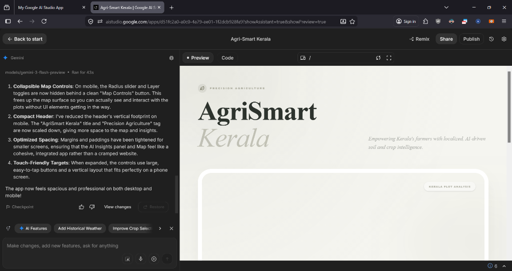
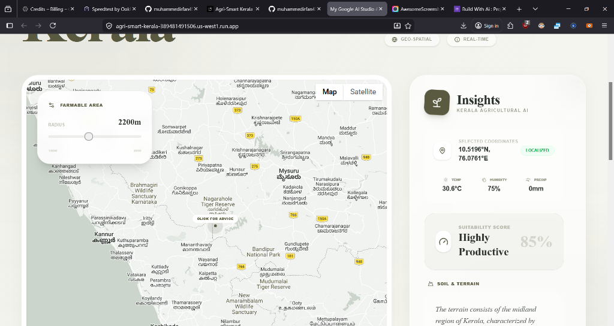
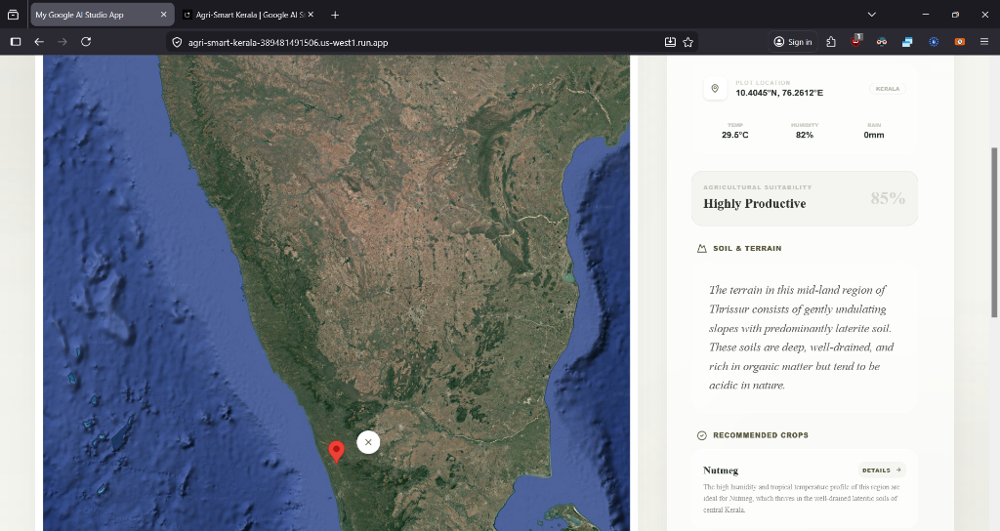

# Agri-Smart Kerala

## Problem Statement
Farmers in Kerala often struggle with a lack of localized, data-driven agricultural advice. General farming guidelines frequently fail to account for the unique micro-climates, specific soil variations at a plot level, and the rapidly changing real-time weather conditions across the state. This information gap leads to sub-optimal crop selection, inefficient resource use, and lower yields for small-scale and commercial farmers alike.

## Project Description
**Agri-Smart Kerala** is a precision agriculture platform designed to empower farmers with hyper-localized intelligence. 

### How it works:
1.  **Interactive Mapping**: Users select their specific plot on an immersive map of Kerala.
2.  **Scale Customization**: A dynamic "Farmable Area" tool allows users to define the exact radius of their land (from 100m to 5km).
3.  **Environmental Integration**: The system automatically fetches real-time local weather data, including temperature, humidity, and precipitation levels.
4.  **AI Analysis**: Using the Gemini 3 Flash model, the app synthesizes coordinates, land scale, and weather data to generate a structured agricultural report.

### Key Features:
*   **Suitability Scoring**: Instant assessment of a plot's agricultural productivity.
*   **Soil & Terrain Analysis**: Localized descriptions of the land's physical characteristics.
*   **Smart Crop Recommendations**: Tailored suggestions for cash crops and food crops based on current conditions and scale.
*   **Expert Tips**: Actionable, professional advice for farming success in the specific region.

## Google AI Usage
### Tools / Models Used
*   **Gemini 3 Flash (`gemini-3-flash-preview`)**: The core reasoning engine used for generating structured agricultural insights.
*   **Google Maps JavaScript API**: Provides the interactive geo-spatial interface for location selection and area visualization.

### How Google AI Was Used
Gemini AI is integrated as a "Virtual Agricultural Expert." It doesn't just provide static text; it performs a multi-factor analysis:
*   **Geo-Spatial Reasoning**: It interprets the specific Latitude/Longitude to understand the regional geography of Kerala (Highlands, Midlands, or Lowlands).
*   **Contextual Synthesis**: It combines the user-defined farm radius and real-time weather metrics to refine its recommendations (e.g., suggesting different irrigation strategies for high-humidity days or different crops for larger-scale plots).
*   **Structured Output**: We utilize Gemini's JSON schema capabilities to ensure the insights are delivered in a clean, structural format that powers our high-end UI components.

## Proof of Google AI Usage

### AI Proof
The entire development lifecycle of **Agri-Smart Kerala** was powered by Google AI (Gemini 3 Flash). This includes:
*   **Code Generation**: All React components, mapping logic, and weather integrations were architected and written by the AI.
*   **Agricultural Logic**: The expert agricultural reasoning for Kerala's specific geography was modeled using Gemini's deep knowledge base.
*   **Documentation**: This README and all project metadata were generated by the AI to ensure professional standards.



### Screenshots
*   **Screenshot 1: Precision Analysis View** - Shows the interactive map with the "Farmable Area" radius set to 2200m. The Insights panel displays real-time weather (30.6°C), localized coordinates, and a high-productivity suitability score of 85%.


*   **Screenshot 2: Satellite Terrain Mapping** - Demonstrates the satellite view mode, allowing farmers to visualize the actual vegetation and terrain of the selected plot while receiving structured AI advice.


### Demo Video
[Watch Demo](https://drive.google.com/file/d/your-video-id/view) *(Replace with your actual Google Drive link)*

## Installation Steps

```bash
# Clone the repository
git clone <your-repo-link>

# Go to project folder
cd agri-smart-kerala

# Install dependencies
npm install

# Run the project
npm run dev
```
